**Stockholm Bombers Baseball** site is designed to welcome people of all skill levels around the area of Stockholm Sweden that want to play adult baseball in a relaxed and fun atmosphere. The site intends to target people that want to build/expand their social network, meet new people and have fun playing ‘America’s Past time’ with like minded people. 

The Stockholm Bombers are a long established adult baseball team, with a rich history that includes athletes of all levels and abilities (from lifelong players to first timers) from all around the world that just love the game and want to have fun. The site hopes to introduce the team, provide practice schedule, game schedule, team pics and a sign-up form. 

**The website color scheme:** The Stockholm Bombers Team colors are white, forest green and red. Therefor I have been working on maintaining and representing the team colors as much as possible through the website.

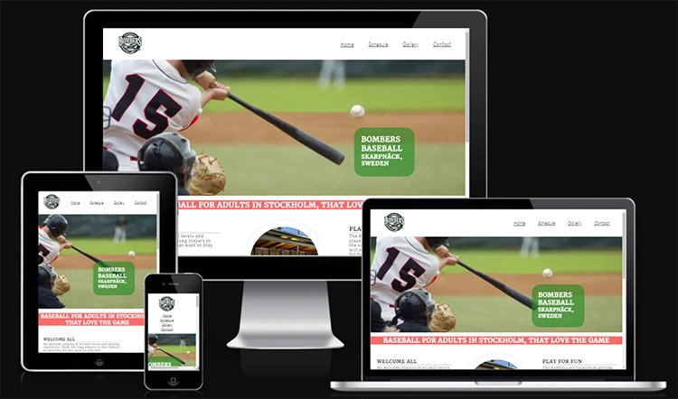

**Features:**

This website consists of four pages that provide information about the team, motivate joining the team and provide multiple ways to contact the team leaders. The site is designed for a visitor to be able to easily navigate from page to page with consistent links and color schemes to be able to find information about the team, where the team plays, an accurate schedule of when the team plays, a gallery of pics showing the team having fun and lastly a means to contact the team and coaches if the visitor wants to play.

**Existing Features:**

-**Navigation bar**

Featured on all four pages there is a consistent and full responsive set of links for the home page, the schedule page, the gallery page and the contact page.

The 'navigation bar' will allow the visitor to move back and forth through the pages without having to use the back arrows on the page.

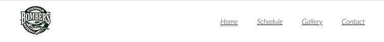

-**Hero image section:**

The landing page 'hero image' is an image intended to stimulate a visitor by providing feelings of excitement, happiness and a sense of pride. The hero image is intended on motivating a person to want to join the team for a chance to replicate the good feelings of hitting a baseball

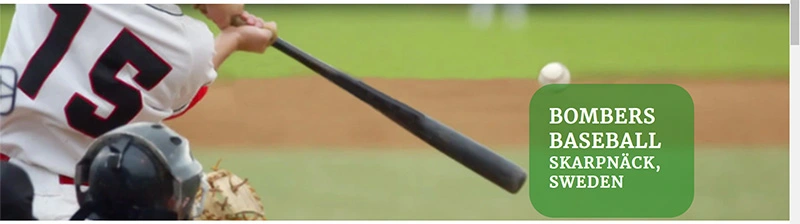

-**About us Section:** 

The 'about us' section aims to provide a quick overview of some of the benefits and draws for people and players to join the team. This section highlights a few of the reasons why playing baseball with the Bombers is fun, beneficial and a great choice.

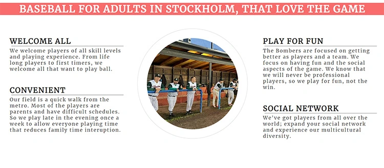

-**The 'Find Us' section:**

There is a map with a pre planned route for a person to travel from the metro station to the field and where the field is located in Stockholm. There are two links: one to the swedish transportion webpage for commuters and the second is to Google maps so that a visitor can find their own directions to the field.

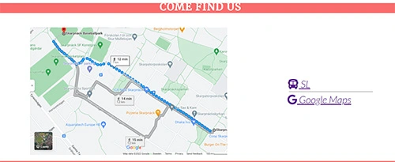

-**Footer:**

The footer section is consistent on every page and contains four links. Two of the icons represent links to our social network site. The third link connects to the club that the Bombers belong that to; which represents the other teams in the club. The last link connects to the Swedish baseball federation that has the team roster, schedule, results and statistics.

-**The Schedule page:**

This area is designed to inciteful and inviting by providing dates, times and location for all the team events for the season.

There are images of the remaining 3 months of the baseball season presented horizontally under the header. Those images contain different color circles that correspond to the information provided directly below the calenders. The  Regional Bombers team practices are represented with red circles and the free drop-in open practices are shown with blue circles. In the middle there is a green table that shows all the information concerning the games for the season with corresponding green circles on the calender.  

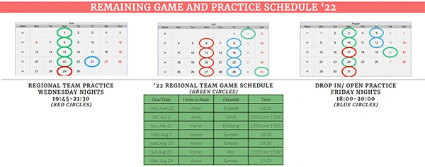

-**The Gallery page:**

On this page a visitor will see a collage of the Bombers team members playing baseball and having fun. The goal of this page is to show that the team is focused on having a good time while playing the game. This page will provide value to the user though representing inclusion, diversity and fun.

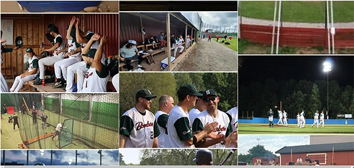

-**The Contact page:**

This page provides the user a means to sign up to join a practice and a means to contact the team and its coaches. 

The form on the left side has contact information and buttons to provide a little background information on the player that wants to join the team. 

On the lower right side there are email links for the baseball team and the two coaches that run the team.

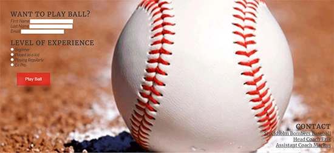

**Future features to include and implement:**

1. In the future I would like to add a “timed slide show effect” to the hero image section to create a rotating background image set for the hero image section of the landing page.

2. I would like to include an interactive schedule with a scroll bar that has highlighted days for the games that link to the Swedish baseball game results page.

3. I have the idea to create a page with links to a few vendors that the players use to buy gloves, bats and other miscellaneous items. With listings and recommendations for appropriate gear.

4. I would also like to set up an online store where Bomber shirts, hats and stickers that I have designed and created can be purchased/ordered.

5. I would also like to create a member section of the webpage that has a messaging service and an events calendar for members to sign up to team events (similar to what exists now in Facebook, but without being on Facebook).

6. I would like to develope a Roster page that has images of each player, a short biography, a 'snap-shot' of thier lifetime with the Bombers stats' and a link to the Federation page for thier current year statistics.

**Testing:**

1. Using https://validator.w3.org/, each page was tested repeatedly to track and debug errors in the code, until all errors were eliminated in all pages of the code.

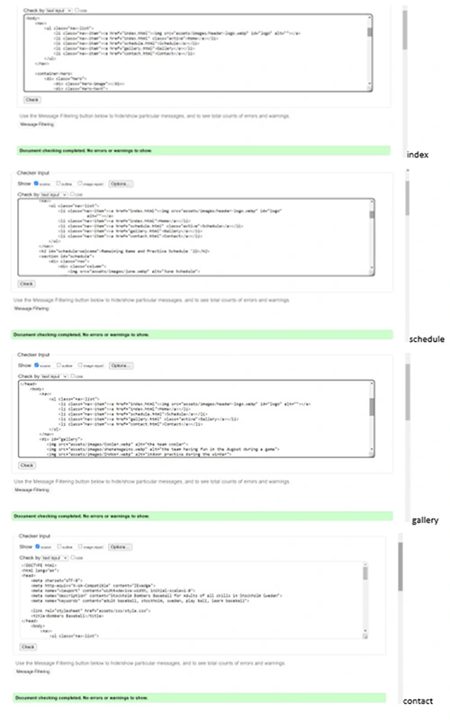

2. using https://jigsaw.w3.org/css-validator/validator, the css stylesheet was tested to track errors and debugged until there are no errors in the code.

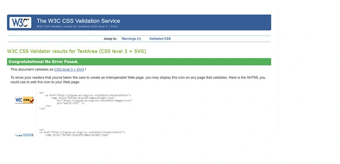

3. Using Chrome Dev Tools to trouble shoot and test all pages repeatedly to track and debug the code for all the pages.

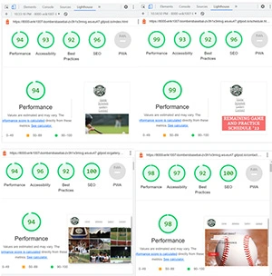

**Unfixed bugs:**

To the best of my knowledge, all bugs were located and fixed during the debugging process.

The main source of bugs that were encountered in the development of this website focused on the issues of responsiveness to varying screen sizes when 'float' was primarily used for 
 and <image> placement. The website was converted to using flex CSS along with changing the media queries  to 'min-width' there by improving the responsiveness of the site to varying screen sizes while maintaining the desired UI aesthetic appeal. 

There is one 'blank' area in the bottom center column of the gallery page that will hold a link to the 'Roster' page that will be developed in the incoming future (see 'Future features to include and implement:' section). 

**Deployment**

The site was deployed to GitHub pages. The steps to deploy are as follows:

1. Enter the GitHub repository. 

2. Navigate to the Settings tab, then selecting the 'pages link on the left side link section. selecting the source section in the drop tab, select the Master Branch.

3. Once the master branch has been selected, the page will be automatically refreshed with a detailed green ribbon display to indicate the successful deployment.

4. The live link can be found here - https://erik1007.github.io/Bombers-Baseball/

**Credits:**

-**Content:**
1. Followed through the lessons in the Code nstitute 'Love Running' and 'Coders Cafe' projects to create the Nav bar, hero image, 'about us', footer, schedule page, gallery page, and contact form set up. Along wth the css responsive code. The Code nstitute lessons and follow along sessions provided much of the code support used in this webpage design.

2. Icons from “fontawesome.com”

3. Links and info from Swedish Bassboll Federation and Stockholm Baseball Klubb.

4. Stackoverflow for media query code in the css, external links assistance and class vs. id setup in the css.

5. Photoshop for rgba codes, image cropping and file conversion.

6. w3c (https://validator.w3.org/) for error debugging and css assistance on class development in the schedule page and gallery page.

7. w3schools.com/howto_css_images_side_by_side.asp to help structure the updated schedule page changes.

8. used (https://www.google.com/search?q=how+to+make+a+nav+bar+with+flex&rlz=1C1ONGR_enSE1005SE1005&oq=how+to+make+a+&aqs=chrome.0.69i59j69i57j0i512l8.4428j0j15&sourceid=chrome&ie=UTF-8#kpvalbx=_zHm1YteHBZ-Jxc8P_-u9mAY16) for help integrating  flex into the navbar.

9. used (https://www.freecodecamp.org/news/how-to-keep-your-footer-where-it-belongs-59c6aa05c59c/) for assistance with keeping the footer in place when screen size changes.

10. used (https://code-institute-room.slack.com/archives/C01C4AU8ULA/p1628185827001300/) for assistance to keep the footer in place when the screen size changes.

**Media:**

1. All gallery images and images of the team were taken by myself, and from the Bombers closed group Facebook group page.

2. Hero image came from http://Dreamstime.com (baseball hit).

3. Contact background image came from http://depositphotos.com (baseball on chalk line)
